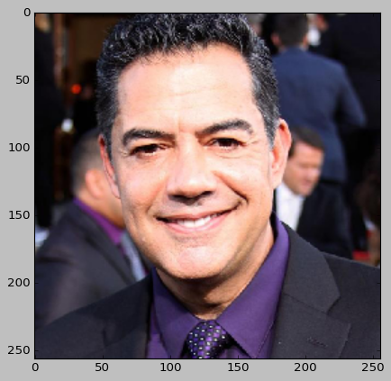
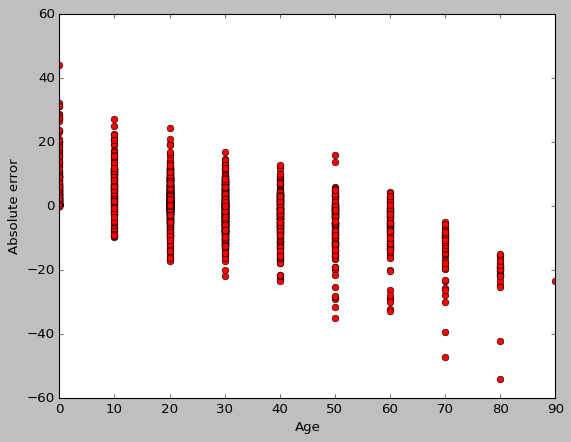
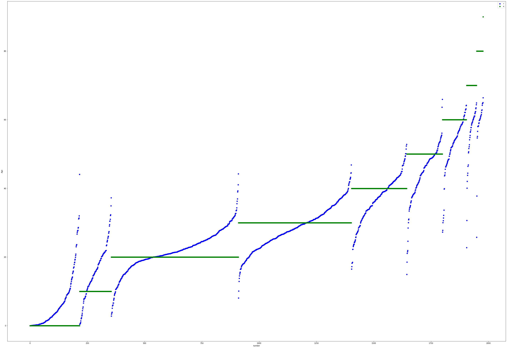

# Apparent age prediction from a single image

Implemented the ability to train an ensemble of neural networks and pre-trained a neural network that performs apparent age estimation.

Related article:
DEX: Deep EXpectation of apparent age from a single image
(Rasmus Rothe, Radu Timofte, Luc Van Gool
Computer Vision Lab, D-ITET, ETH Zurich, Switzerland)

Datasets: 
1. Open IMDB dataset (https://data.vision.ee.ethz.ch/cvl/rrothe/imdb-wiki/)
2. APPA-REAL (real and apparent age)(https://chalearnlap.cvc.uab.cat/dataset/26/description/)
3. ImageNet

Example:

 
Model output (age):
42.15

In order for this solution to be used in other projects, the launch of the server (app.py) has been implemented.
Using the server is very simple: check the example (Simple_post.py).
After a request with a photo, we get the age.

After POST request from Simple_post.py
GET request returns:
{'Harry Potter': '13.72', 'Hermione Granger': '19.5'}
Images are in the images folder.

Accuracy: Average absolute prediction error: 6 years.

Model prediction and labels (All ages have been rounded to the nearest tens).

At the output of the neural network there are 10 neurons with probabilities corresponded to 0, 10, 20 ... 90 years. The probabilities are assigned to the corresponding ages and the final result is obtained.

Google colab was used to train the model.
Accuracy can be improved by using longer training and increasing the number of neurons in fully connected parts of the network
(according to the original VGG16 architecture).
